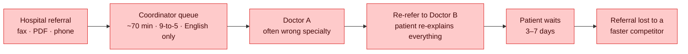
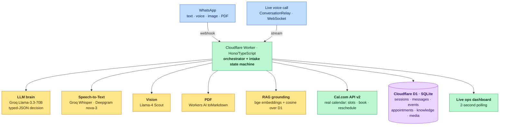
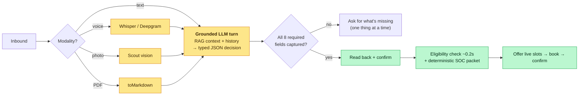
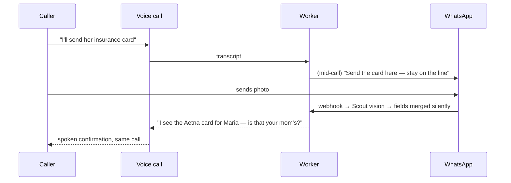
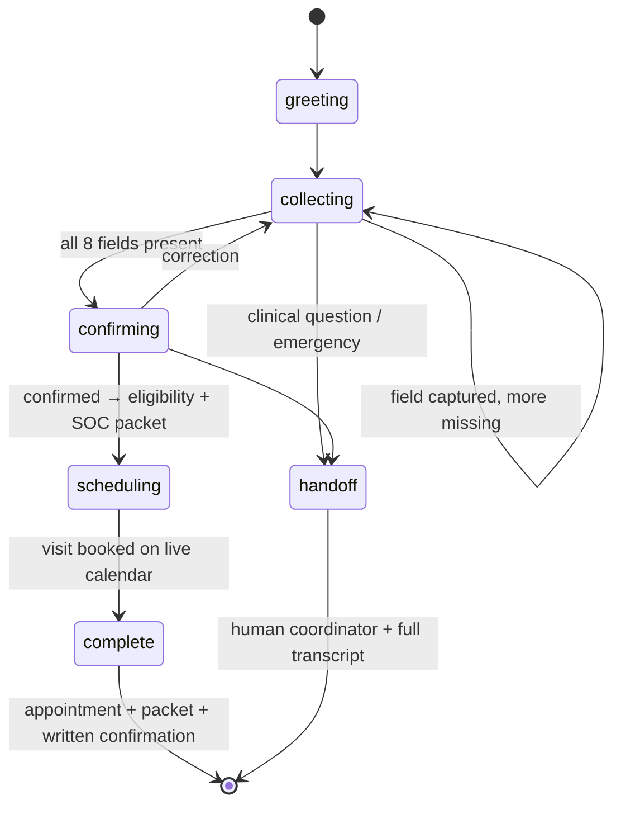
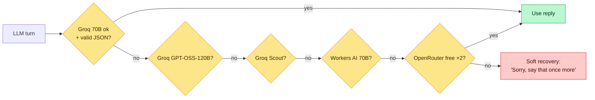

# CareLine AI — Design Review

*A start-of-care intake voice agent for home health. Turns a referral into a booked visit in one ~90-second conversation, in the caller's own language, with zero human data entry.*

**Live:** https://careline-ai.rsusny.workers.dev · **Read time:** ~13 min · all data in the demo is synthetic (no real patient data).

---

## 0 · Why I built this (the origin)

I grew up in the **Andaman and Nicobar Islands**. Healthcare there is a chain of hand-offs: a patient explains their problem to one clerk, waits, sees a doctor, gets referred to another doctor, re-explains everything, waits again. I watched people who were completely fluent and confident in their **native language** go quiet and helpless the moment intake was in a language they didn't own — the information was *in their head*, but the form wanted it in someone else's words. Days were lost not to medicine, but to **paperwork and translation friction** before anyone was even seen.

CareLine AI is the system I wish those patients had: **talk in whatever language you're comfortable in, send a photo of your card, and walk away with an actual appointment** — no re-explaining, no waiting for a callback, no wrong-doctor detour.

---

## 1 · Problem Framing *(2–3 min)*

**The problem I chose:** *Start-of-Care (SOC) intake for home health* — everything between "a hospital discharges a patient who needs home care" and "a nurse is actually scheduled to walk into their home."

**Why it's hard — four forces at once:**

| Force | What makes it hard |
|---|---|
| **Multimodal input** | Information arrives as speech, typed text, insurance-card photos, and discharge PDFs — often several at once, often messy. |
| **Multilingual callers** | The person is frequently a stressed family member with Limited English Proficiency (LEP). The data is in their head; the friction is the language. |
| **A competitive clock** | A hospital case manager shops one referral to 3–5 agencies — **the fastest to accept keeps the patient.** Slow intake = lost revenue ("referral leakage"). |
| **A regulatory clock** | CMS (Centers for Medicare & Medicaid Services) requires the SOC comprehensive assessment (including OASIS — Outcome and Assessment Information Set) **within 5 calendar days** (42 CFR §484.55); the Timely Initiation of Care measure (NQF #0526 — National Quality Forum) expects the patient seen **within ~48 hours**. |

**The market, in numbers:**

| Metric | Figure | Source |
|---|---|---|
| Non-clinical share of every post-acute dollar | **~25¢** | Post-acute industry commentary (2025) — *directional* |
| US home health market, 2024 → 2030 | **$162.3B → $284.3B** (9.8% CAGR) | Grand View Research |
| CMS spend, freestanding home health agencies, 2022 | **$132.9B** | CMS National Health Expenditure Accounts |
| "Distributed care" Total Addressable Market (TAM) | **~$400B**, ~**$200B** non-clinical admin payroll | Industry estimate — *directional* |
| Coordinator time per referral packet | **~70 minutes** | Industry estimate — *directional* |
| National Timely-Initiation-of-Care performance | **~96%** | CMS Care Compare |

**The core insight:** intake is simultaneously **slow** (≈70 minutes of skilled human time), **competitive** (fastest wins), and **non-clinical** (pure cost). That is exactly the kind of work an AI agent should absorb — and the exact place a language barrier does the most damage.



---

## 2 · System Design *(5–6 min)*

**One idea holds the whole system together: the caller's phone number is the primary key.** Every channel — WhatsApp text, voice note, photo, PDF, live call — reads and writes the *same* session record. That is what lets someone be asked for a document on a phone call, send it on WhatsApp, and be answered *back on the call*.

### 2.1 Architecture



**Full forms:** RAG = Retrieval-Augmented Generation · LLM = Large Language Model · STT = Speech-to-Text · TTS = Text-to-Speech · D1 = Cloudflare's serverless SQLite database · API = Application Programming Interface.

### 2.2 The turn pipeline (what happens per message)



The LLM never returns free-form prose that we parse loosely. It returns a **typed decision object** — `{reply, field_updates, user_confirmed, language, guardrail, booked_slot_id, …}` — validated before we act on any of it. This single design choice is what keeps the system honest (see §5, §Appendix A).

### 2.3 Cross-channel continuity (the signature moment)



### 2.4 The state machine



**Data flow in one line:** *modality-specific extractor → grounded typed-JSON LLM turn → merge into phone-keyed session → advance state machine → (on completion) verify insurance + build packet + book real calendar slot → update dashboard + send confirmation.*

---

## 3 · Tradeoffs *(3–4 min)*

Each row is a real decision, the alternative I rejected, and — importantly — **what evidence would flip my choice.**

| Decision | Alternative considered | Why I chose it | What would change my mind |
|---|---|---|---|
| **Synchronous TwiML reply** in the WhatsApp webhook | Async REST send after processing | Twilio KYC (Know Your Customer) approval was pending, which blocks outbound REST. Replying *inside* the webhook works pre-approval and is simpler. | If processing routinely exceeds Twilio's ~15s webhook budget, I'd move heavy work to a queue and REST-send. |
| **Typed JSON schema** for every LLM turn | Free-form text + regex/prompt parsing | Eliminates hallucinated fields; validation happens at the tool boundary and forces a retry on malformed output. | Nothing short-term — this is the backbone of correctness. |
| **Deterministic SOC packet** (built from fields in code) | LLM-generated packet | A patient-facing clinical summary must have **zero** fabrication risk; code can't hallucinate. | If packets needed genuine free-text synthesis (e.g., nurse narrative), I'd use an LLM behind strict grounding + human sign-off. |
| **6-model fallback chain**, 3 providers | Single model | Free-tier quotas *will* run out mid-demo (they did). Independent quotas = the conversation never dies. | On paid dedicated capacity, I'd shrink to 2 for latency and cost predictability. |
| **Cal.com API** (real calendar) | Build our own scheduling table | Real bookings, invites, reschedule links, calendar sync — for free, in hours. | At multi-tenant scale with custom clinician rules, I'd build a scheduling service. |
| **Cloudflare D1 + Workers** (edge) | Postgres + a Node server | Zero cold start, $0, one deploy artifact, SQLite is plenty for this shape. | Heavy relational/analytics needs or >10 GB → managed Postgres via Hyperdrive. |
| **Media proxy** (store URL, stream on demand) | Store image bytes in the database | No database bloat, no size limits, dashboard still shows the file. | If source URLs expire before review, I'd copy bytes into object storage (R2). |
| **Deepgram `multi`** live STT (10 languages, auto-detect) | One monolingual model per call | Auto-detection + code-switching with no menu; covers most callers. | For a language `multi` can't hear (e.g., Chinese), I switch that call to a specific-language model (see §4). |

---

## 4 · Failure Modes *(2 min)*

**Design principle: every external dependency has a fallback, and every failure is *visible* on the dashboard** — nothing fails silently.

| What breaks | How the system behaves |
|---|---|
| **LLM provider down / rate-limited** | 6-model chain fails over across Groq → Workers AI → OpenRouter; each hop's JSON is validated, so a *garbage* reply is treated like a *dead* endpoint. Fallback is logged as an event. |
| **Speech-to-Text miss** | Groq Whisper → Deepgram nova-3 fallback for voice notes. |
| **Chinese (or any non-`multi` language) on a live call** | Deepgram's `multi` model **cannot transcribe Chinese** — the real root cause of a failure we hit. Mitigation: a caller known to prefer Chinese opens the call in a Chinese-specific STT model with a native greeting; unknown cold callers are warmly routed to WhatsApp (where Whisper handles Chinese). Honest, bounded, never a dead call. |
| **Scheduling API unreachable** | Cal.com is source of truth; a local D1 calendar takes over so booking still completes. |
| **Caller talks over the agent** | Barge-in interruption; speech that arrives mid-processing is *queued and merged*, never dropped. |
| **Caller asks for medical advice** | Hard refusal → logged guardrail event → nurse hand-off. Never answered. |
| **Emergency** ("chest pain", "can't breathe") | Immediate "call 911" + human hand-off state. |
| **Processing exceeds webhook budget** | Acknowledge instantly, finish the reply out-of-band. |



---

## Appendix

### A · How hallucination is handled (defence in depth)

Hallucination is attacked at **four independent layers**, so no single failure produces a fabricated fact:

1. **Typed extraction.** The LLM emits a validated JSON schema, not prose. Fields it didn't hear stay empty — it cannot invent a member ID.
2. **Grounded answers (RAG).** Questions about policy/coverage are answered *only* from a retrieved knowledge corpus; if nothing relevant is retrieved, the agent says "a coordinator will confirm" instead of guessing.
3. **Read-back confirmation.** Intake cannot complete until the human confirms the fields spoken back to them.
4. **Deterministic outputs.** The Start-of-Care packet and the insurance-eligibility result are built by **code**, not generated — the two most consequential artifacts have zero model creativity.

### B · The math & algorithms (the interesting bits)

#### 1. Semantic retrieval — cosine similarity

Every policy chunk and every caller question is turned into a list of 768 numbers (a "vector") by the `bge-base-en-v1.5` embedding model. Two pieces of text with similar *meaning* get similar vectors. We measure similarity with the **cosine of the angle** between the two vectors:

```
                       q · d
cosine(q, d)  =  ─────────────────
                    ‖q‖ · ‖d‖

  q · d   = dot product  (multiply the vectors element-by-element, then sum)
  ‖q‖     = length/magnitude of the vector = sqrt(sum of its squares)
```

- **In words:** it scores how much two texts "point the same way" in meaning — `1.0` = identical meaning, `0` = unrelated — *independent of length*, so a 5-word question can still match a long paragraph.
- **Why this and not keyword matching:** a caller asking "do you cover my area?" should match a chunk titled "Service area & coverage" even with zero shared words. Cosine on embeddings captures meaning; keyword search can't. It's also cheap — one dot product and two magnitudes per chunk. We take the top-k highest-scoring chunks as grounding (with a keyword search as a fallback if embeddings fail).

#### 2. Collision-free, time-safe slot IDs

A scheduling bug once booked a *different* time than the one spoken, because slot IDs were **positional** (1st, 2nd, 3rd in the list) — and the list reordered between turns, so "slot 2" pointed at a new time. The fix derives the ID from the slot's own start time:

```
id = floor(start_time_in_milliseconds / 60000) mod 1,000,000

  floor(… / 60000)   → convert milliseconds to a whole-minute stamp
  mod 1,000,000      → keep it a short, tidy number
```

- **In words:** the ID *is* the appointment time (rounded to the minute), so the **same time always produces the same ID** across turns.
- **Why:** it makes the identifier immutable and self-describing — the agent can never book a time it didn't offer, because the ID it acts on is derived from the time itself, not from a fragile list position.

#### 3. Resilience as a validated chain

The model fallback isn't just "try the next model on error." Each candidate's output must also **parse as valid JSON** to be accepted — otherwise it's discarded exactly like a dead endpoint, and we move to the next model.

- **In words:** a model that's *up but talking nonsense* is treated the same as a model that's *down*.
- **Why:** it enforces correctness and availability in one loop — we never act on a malformed decision, and we never stall on one bad provider.

#### 4. Rule-based eligibility

Insurance acceptance is a deterministic match of the caller's payer against an accepted-plan set — instant (~0.2s), auditable, no model involved.

- **In words:** a simple lookup: "is this plan on our accepted list, and does it need prior authorization?"
- **Why:** eligibility must be *exact and explainable* — a rule you can point at, and a clean stand-in for a real EDI 270/271 (Electronic Data Interchange) payer check in production.

### C · Mistakes & learnings (honest)

| Mistake | Learning |
|---|---|
| Built on a single free LLM; its daily quota ran dry mid-testing. | **Design for provider failure from day one** — I added the multi-provider chain only after it bit me. |
| Assumed Deepgram's multilingual model covered *all* languages; Chinese silently failed on voice. | **Verify capability claims per-feature.** "Multilingual" ≠ "your language." Know your dependency's real matrix. |
| Slot IDs were positional → booked the wrong time. | **Derive identifiers from immutable data**, never from list position. |
| Voice initially re-introduced itself and talked over the caller. | **Conversation state (greeting done? caller mid-sentence?) is as important as data state.** |
| Let a document's language flip the conversation language. | **Language should follow the *speaker*, not the artifact.** |

### D · Future scope

- Complete Twilio Trust Hub / KYC → own a phone number → **outbound calls** (the agent calls the patient) and inbound PSTN (Public Switched Telephone Network) go live — code already wired.
- Replace rule-based eligibility with a real-time **payer EDI 270/271** integration.
- **Coordinator dashboard actions** (message, reschedule, mark visit complete) and multi-tenant deployment for many agencies.
- HIPAA (Health Insurance Portability and Accountability Act) posture: Business Associate Agreements (BAAs), audit logging, encryption at rest — the architecture already isolates Protected Health Information (PHI) to one store.
- Broaden guaranteed-native voice languages as multilingual STT models expand.

### E · Quantified impact

| Lever | Today | With CareLine | Improvement |
|---|---|---|---|
| Intake handling time | ~70 min | ~90 sec | **~98% reduction** |
| Human data-entry minutes | ~70 | **0** | eliminated |
| Insurance eligibility check | ~1 business day | ~0.2 s | orders of magnitude |
| Referral → *booked* visit | 3–7 days | one conversation | days → seconds |
| Availability / languages | 9-to-5, English | 24/7, 10+ languages | — |
| Infrastructure cost | staffed call center | **$0** (free tier) | — |

**Illustrative economics** *(directional, to show shape of impact — not audited):* at a loaded coordinator cost of ~$35/hour, saving ~68 minutes per referral is **≈ $40 in labor per referral**. More importantly, home health revenue is *referral-capture-limited*: under the CMS Patient-Driven Groupings Model a 30-day episode pays on the order of **$2,000–3,000**. For an agency handling **1,000 referrals/year**, capturing even **5% more** referrals by being the always-on, any-language, instant-accept option is **≈ 50 additional admissions ≈ $100K–150K/year in captured revenue** — on top of ~$40K/year in reclaimed labor. The non-clinical 25¢-per-dollar is exactly the slice this attacks.

**The human impact is the point, though:** a family member in the Andaman Islands — or in Queens, New York — describes their mother's needs in their *own* language, sends a photo, and hangs up with a nurse booked for Monday. No re-explaining. No wrong-doctor detour. No days lost to paperwork. That is the gap I set out to close.

---

### Glossary

AI — Artificial Intelligence · LLM — Large Language Model · STT — Speech-to-Text · TTS — Text-to-Speech · RAG — Retrieval-Augmented Generation · SOC — Start of Care · OASIS — Outcome and Assessment Information Set · CMS — Centers for Medicare & Medicaid Services · NQF — National Quality Forum · CAGR — Compound Annual Growth Rate · TAM — Total Addressable Market · API — Application Programming Interface · PSTN — Public Switched Telephone Network · KYC — Know Your Customer · EDI — Electronic Data Interchange · PHI — Protected Health Information · LEP — Limited English Proficiency · HIPAA — Health Insurance Portability and Accountability Act · BAA — Business Associate Agreement.
