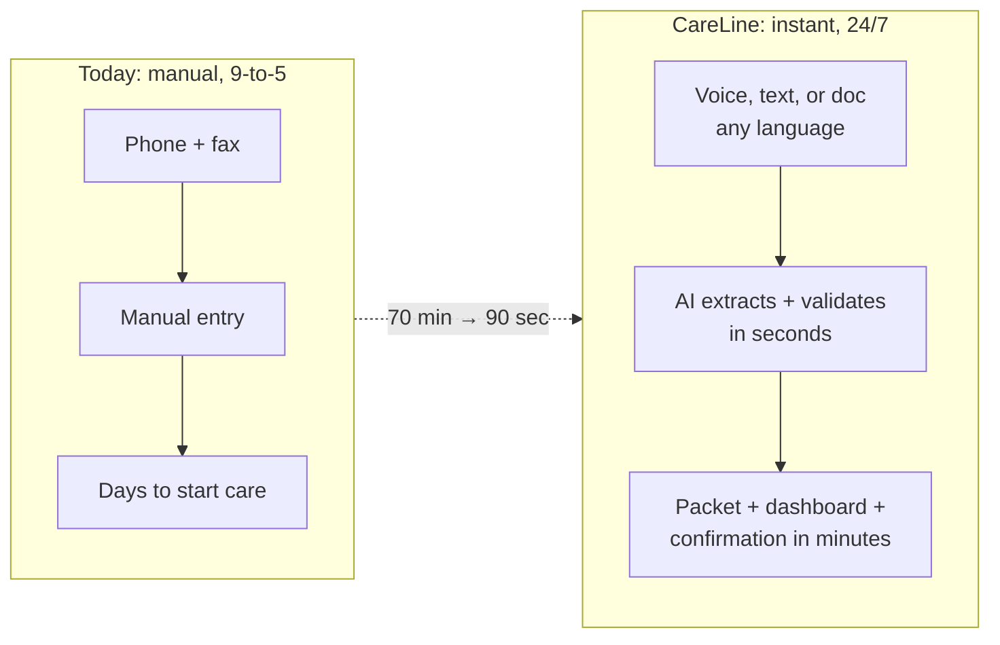
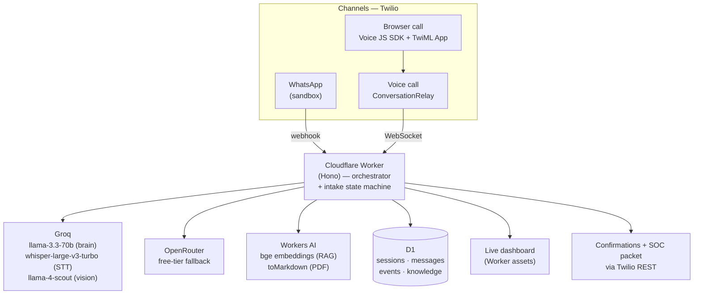
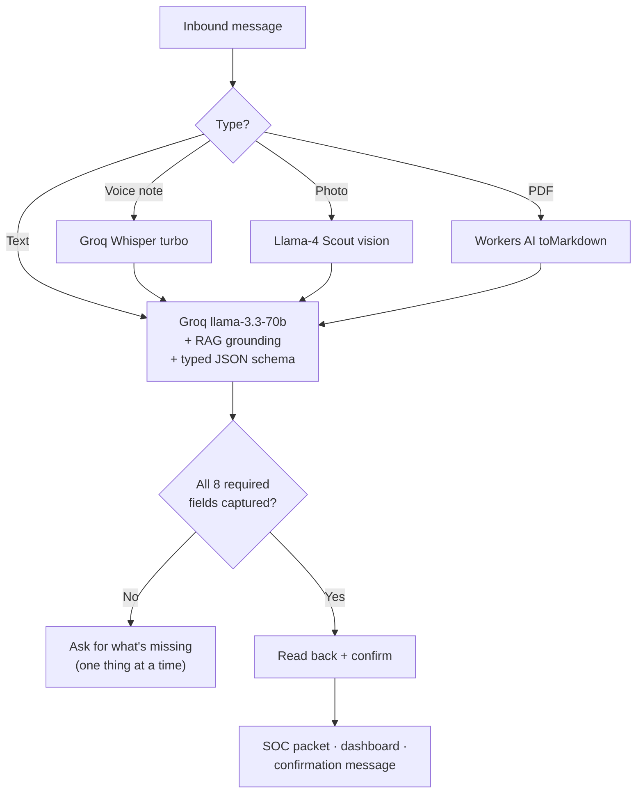
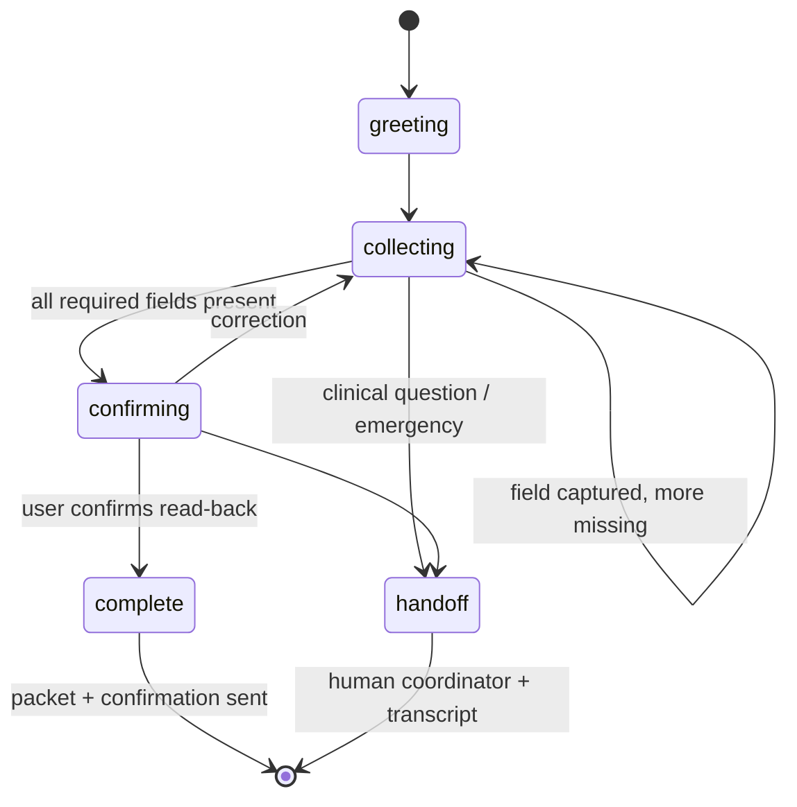
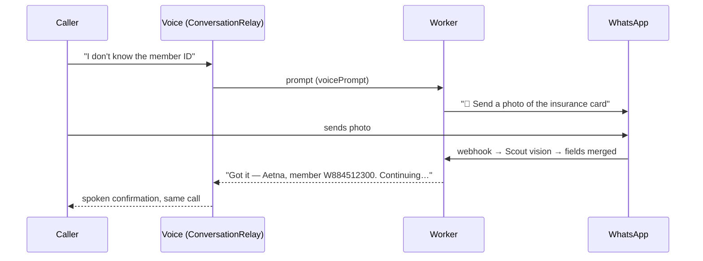

# CareLine AI 🏥📞

**A multimodal patient intake & care-coordination agent that turns the slowest step in healthcare — getting a patient into the system — into a 90-second conversation on WhatsApp or a phone call. Any language. Any hour. Zero human data entry.**

Built in one day at **AI Healthcare Hack NYC** (Arya Health × Twilio AI Startup Searchlight).

**Live demo:** https://careline-ai.rsusny.workers.dev *(dashboard + 📞 Call Cara button)*

---

## The problem

Patient intake still runs on phone tag, fax, manual data entry, business hours, and English only. An intake coordinator spends **~70 minutes** on a single referral packet; ~25.7M US residents have limited English proficiency; and the world is short ~11M health workers. Every hour of delay is a referral lost to a faster competitor — and a patient waiting for care.

## What we built

One AI agent, one phone-number-keyed session, every channel:

- 💬 **WhatsApp text** — natural conversation, 30+ languages, auto-detected
- 🎤 **Voice notes** — Whisper transcription (any language)
- 📸 **Photos** — snap an insurance card, vision model reads the member ID
- 📄 **PDFs** — send a discharge referral, every field extracted in one shot
- ☎️ **Live voice call** — real-time agent via Twilio ConversationRelay (browser or PSTN)
- 🔀 **Cross-channel magic** — mid-call, Cara texts you for the insurance card; the photo lands in the *same* session and she confirms it *on the call*

Every answer is grounded in the agency's policy corpus (RAG), every field lands in a typed schema, every intake ends with a generated start-of-care packet, a live dashboard update, and a confirmation message.



## Architecture



### The multimodal pipeline



### The intake state machine



### Cross-channel session continuity

The caller's **phone number is the session key**. A voice call, a WhatsApp photo, and an SMS all hydrate the *same* intake record — which is how Cara can ask for a document on a call, receive it on WhatsApp, and confirm it back on the call.



## Guardrails (the part healthcare judges care about)

| Guardrail | Implementation |
|---|---|
| No clinical advice, ever | Hard rule in system prompt → refusal + `guardrail` event logged + nurse follow-up |
| Emergencies | Immediate "call 911" + handoff state + event log |
| No hallucinated policy | Answers only from the RAG corpus; unknown → "a coordinator will confirm" |
| No hallucinated fields | Typed JSON schema output; server-side merge; read-back confirmation before completion |
| LLM outage | Automatic Groq → OpenRouter fallback (logged) |
| Privacy | 100% synthetic data; secrets in Worker secrets, never in code; masked phone numbers on the dashboard |

Every guardrail firing is visible in the dashboard's event log — judges can watch the agent refuse a medication question live.

## Stack (all free tier)

| Layer | Tool |
|---|---|
| Telephony + messaging | **Twilio**: WhatsApp Sandbox, Voice + **ConversationRelay** (ElevenLabs TTS, Deepgram STT), Voice JS SDK + TwiML App for browser calls |
| Compute + hosting | **Cloudflare Workers** (Hono) + static assets |
| Brain | **Groq** llama-3.3-70b-versatile (~300ms turns) |
| Voice notes | **Groq** whisper-large-v3-turbo |
| Image reading | **Groq** llama-4-scout vision |
| PDF reading | **Cloudflare Workers AI** toMarkdown |
| RAG | **Workers AI** bge-base-en-v1.5 embeddings + cosine in-Worker over D1 chunks |
| Sessions/state | **Cloudflare D1** (SQLite) |
| Fallback LLM | **OpenRouter** free tier |

## Repo tour

```
src/
  index.ts     — routes: WhatsApp webhook, voice TwiML, WS upgrade, dashboard API, admin
  agent.ts     — the core turn: RAG → LLM → field merge → state machine → packet
  prompts.ts   — persona, guardrails, typed-JSON output contract
  llm.ts       — Groq + OpenRouter clients, Whisper, Scout vision, PDF extraction
  voice.ts     — ConversationRelay WebSocket handler + Gather fallback + doc-request poller
  token.ts     — Twilio Voice access token (JWT) for browser calls
  rag.ts       — embeddings + cosine retrieval (keyword fallback)
  db.ts        — D1 session/message/event store
  knowledge.ts — synthetic agency policy corpus
public/
  index.html   — live intake dashboard ("patient monitor" UI) + Call Cara button
  demo/        — synthetic insurance card, referral PDF, voice note (demo ammo)
migrations/    — D1 schema
```

## Run it yourself

```bash
npm install
npx wrangler d1 create careline-db          # put the id in wrangler.jsonc
npx wrangler d1 migrations apply careline-db --remote
npx wrangler secret bulk secrets.json       # TWILIO_*, GROQ_API_KEY, OPENROUTER_API_KEY, ADMIN_KEY
npx wrangler deploy
curl -X POST https://<worker-url>/admin/seed -H "x-admin-key: <ADMIN_KEY>"
```

Then point the Twilio WhatsApp Sandbox inbound webhook at `https://<worker-url>/webhook/message` and (optionally) a phone number's voice webhook at `https://<worker-url>/voice`.

### Demo flow (3 minutes)

1. **Frame it** — "Intake is a 70-minute, English-only, 9-to-5 process. Watch it become a 90-second conversation."
2. **WhatsApp** — send a voice note describing a patient → fields fill on the dashboard live. Snap the (synthetic) insurance card → member ID appears. Send the referral PDF → *everything else* fills in one shot.
3. **Guardrail** — ask "should she double her furosemide?" → watch the refusal + 🛡️ event.
4. **Confirm** — "yes, all correct" (in Spanish, if you like) → status flips to complete, SOC packet renders, confirmation arrives on your phone.
5. **Voice** — click **📞 Call Cara**, talk to her; she texts you mid-call for a document; the photo lands in the same session; she confirms it on the call.

*Everything above is synthetic data. No real PHI anywhere.*

---

Built with Twilio ConversationRelay, Cloudflare Workers, Groq, and Claude Code.
