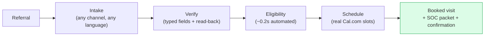
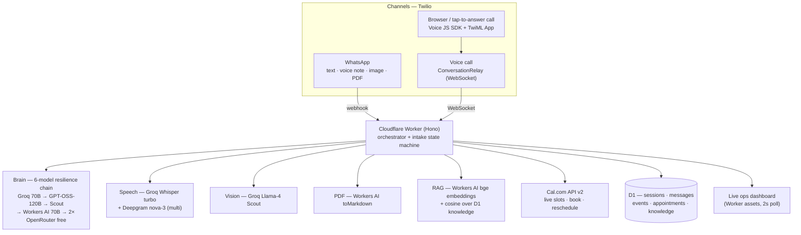
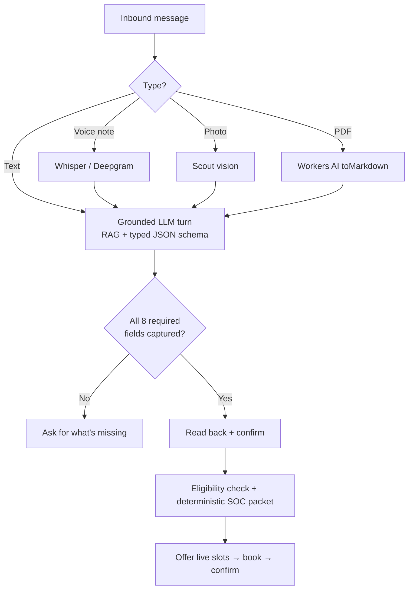
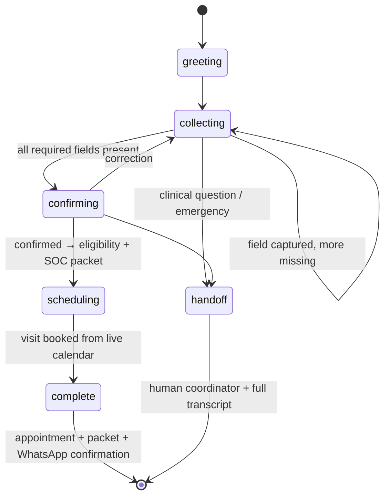
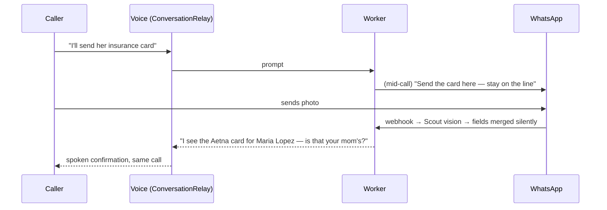

# CareLine AI 🏥📞

**The start-of-care intake agent that turns a referral into a booked home-health visit — in one 90-second conversation, in any language, at any hour, with zero human data entry.**

Built in one day at **AI Healthcare Hack NYC** (Twilio AI Startup Searchlight).

**Live demo:** https://careline-ai.rsusny.workers.dev · **Repo:** https://github.com/roshaninfordham/intakecare-ai

> *All data in the demo is synthetic. No real PHI anywhere.*

---

## Why this project

The single most expensive step in home health isn't clinical — it's getting the patient *into* the system. Post-acute providers spend **~25¢ of every dollar on non-clinical work**: the phone tag, faxing, re-typing, and eligibility chasing that sits between a hospital discharge and a nurse actually walking into the patient's home.

**CareLine AI is a start-of-care intake agent that removes that step.** It collapses intake from a multi-day, English-only, business-hours relay into one conversation the patient has on the channel already in their pocket — and it doesn't stop at a summary; it **books the start-of-care visit on the agency's real calendar before the call ends.**

---

## The problem, in numbers

Home health is a large, fast-growing market whose margins are eaten by administrative labor — and whose clock starts the moment a referral arrives.

| Metric | Figure | Source |
|---|---|---|
| Non-clinical share of every post-acute dollar | **~25¢** | Post-acute care industry commentary (2025) — *directional* |
| US home healthcare market, 2024 | **$162.3B** | Grand View Research |
| …projected 2030 (9.8% CAGR) | **$284.3B** | Grand View Research |
| CMS spend on freestanding home health agencies, 2022 | **$132.9B** | CMS National Health Expenditure Accounts |
| US "distributed care" TAM | **~$400B**, of which **~$200B** is non-clinical admin payroll | Industry estimate — *directional* |
| Start-of-care comprehensive assessment (incl. OASIS) must be completed | **within 5 calendar days** of the SOC date | 42 CFR §484.55 |
| Timely Initiation of Care — patient seen after referral | **within ~48 hours** | NQF #0526 (CMS Care Compare measure) |
| National timely-initiation performance | **~96%** | CMS Care Compare |
| Intake coordinator time to review one referral packet | **~70 minutes** | Industry/trade estimates — *directional* |
| Agencies a hospital case manager shops a referral to | **3–5; the fastest to accept wins the patient** | Industry/trade estimates — *directional* |

**Read those last two rows together.** Intake is both slow (70 minutes of skilled human time per packet) and competitive (the agency that accepts first keeps the patient). Every minute a coordinator spends re-typing an insurance card is a minute a competitor can win the referral — this is *referral leakage*, and it is a direct revenue loss, not just an efficiency problem. Meanwhile the regulatory clock (48-hour timely initiation, 5-day SOC assessment) is already running.

CareLine attacks the 25¢ directly: it removes the human data-entry step entirely, answers 24/7 in the patient's language, and converts the referral to a *scheduled visit* in seconds instead of days.

---

## What CareLine does — and what it costs to run

| | Today (manual) | With CareLine |
|---|---|---|
| Referral → **booked** start-of-care visit | 3–7 days of phone tag | **one conversation (~90 s)** |
| Human minutes of data entry per intake | ~70 | **0** |
| Insurance eligibility check | queued for "1 business day" | **~0.2 s, automated, inline** |
| Availability | business hours, English | **24/7**, native voice in EN/ES/HI/FR/PT + more via text |
| Hallucination risk on captured fields | human transcription error | **typed JSON schema + read-back confirmation** |
| Infrastructure cost | staffed call center | **$0** (all free-tier; Twilio on promo credit) |

One AI agent ("Cara"), one session keyed to the caller's phone number, every channel:

- 💬 **WhatsApp text** — natural conversation, auto-detected language, mid-chat switching
- 🎤 **Voice notes** — transcribed in any language
- 📸 **Photos** — snap an insurance card; the vision model reads payer + member ID
- 📄 **PDFs** — send a discharge referral; every intake field extracted in one shot
- ☎️ **Live voice call** — real-time agent via Twilio ConversationRelay (browser or phone), natural American-English voice, barge-in interruption, typing ambience while she "notes it down"
- 🔀 **Cross-channel continuity** — mid-call, send the insurance card on WhatsApp; it lands in the *same* session and Cara confirms it *out loud on the call* within seconds

And the loop actually **closes**:



The moment intake is confirmed, Cara verifies insurance, generates the start-of-care packet, pulls **live availability from the agency's real calendar (Cal.com)**, and **books the first visit in the same conversation** — urgent discharges get the earliest slot. The booking lands on the clinic's actual calendar with an email invite; a written confirmation goes to the patient's WhatsApp; the ops dashboard updates in real time. Need to change it? Say so, by chat or by voice, and Cara reschedules the *real* booking.

Returning callers are recognized by phone number, greeted by name with their history (*"how has your mom been since the Mount Sinai discharge?"*), never re-asked known information, and their new symptoms are routed to the right specialist from the clinician roster.

---

## Architecture



### The multimodal pipeline



### The intake state machine



### Cross-channel session continuity

The caller's **phone number is the session key**. A voice call, a WhatsApp photo, and an SMS all hydrate the *same* intake record — which is how Cara can be asked for a document on a call, receive it on WhatsApp, and confirm it back on the call.



---

## What we engineered for (reliability, not just a happy path)

Judges of a *healthcare* build care about what happens when things go wrong. These are first-class:

| Concern | How CareLine handles it |
|---|---|
| **No clinical advice, ever** | Hard rule in the system prompt → refusal + `guardrail` event logged + nurse follow-up. Visible live on the dashboard. |
| **Emergencies** | "Call 911 now" + handoff state + event log |
| **No hallucinated policy** | Answers only from the RAG corpus; unknown → "a coordinator will confirm" |
| **No hallucinated fields** | Typed JSON schema output, server-side merge, read-back confirmation before completion |
| **No hallucinated packet** | The start-of-care packet is built **deterministically from the typed fields — never generated by an LLM** |
| **LLM outage / rate limits** | **6-model fallback chain** across 3 providers with independent quotas; JSON output validated at each hop, so a garbage response fails over like a dead endpoint |
| **Voice STT redundancy** | Groq Whisper primary, Deepgram nova-3 fallback |
| **Scheduling outage** | Cal.com is source of truth; a local D1 calendar takes over if the API is unreachable — the conversation never breaks |
| **Correct gendered speech** | Cara is a woman; in Hindi/Spanish/French/Arabic she uses feminine first-person grammar, and never mistakes the caller for the patient |
| **Privacy** | 100% synthetic data; secrets in Worker secrets, never in code; phone numbers masked on the dashboard |

---

## Stack (all free tier)

| Layer | Tool |
|---|---|
| Telephony + messaging | **Twilio** — WhatsApp, Voice + **ConversationRelay** (ElevenLabs TTS, Deepgram STT), Voice JS SDK + TwiML App for browser/tap-to-answer calls |
| Compute + hosting | **Cloudflare Workers** (Hono/TypeScript) + static assets — one edge Worker runs everything |
| Brain | **Groq** llama-3.3-70b (JSON mode) in a 6-model resilience chain |
| Voice notes | **Groq** whisper-large-v3-turbo + **Deepgram nova-3** fallback |
| Live-call STT | **Deepgram nova-3** multilingual (`multi` auto-detect) via ConversationRelay |
| Live-call TTS | **ElevenLabs** (Jessica — natural American English) via ConversationRelay, per-language voice tagging |
| Image reading | **Groq** llama-4-scout vision |
| PDF reading | **Cloudflare Workers AI** toMarkdown |
| RAG | **Workers AI** bge-base-en-v1.5 embeddings + in-Worker cosine over D1 chunks |
| Scheduling | **Cal.com API v2** — live slots, real bookings + reschedules (D1 local-calendar fallback) |
| Sessions / state | **Cloudflare D1** (SQLite) |
| Fallback LLM | **OpenRouter** free tier |

**Total infrastructure cost: $0.** What a production deployment adds is dedicated LLM capacity (no free-tier quotas), an owned phone number (a Twilio Trust Hub / KYC step), and HIPAA BAAs — the architecture itself is unchanged.

---

## Repo tour

```
src/
  index.ts     — routes: WhatsApp webhook, voice TwiML, WS upgrade, dashboard API, admin
  agent.ts     — the core turn: RAG → LLM → field merge → state machine → eligibility → packet → booking
  prompts.ts   — persona, guardrails, specialist roster, typed-JSON output contract
  llm.ts       — 6-model chat chain, Whisper, Scout vision, PDF extraction
  voice.ts     — ConversationRelay WebSocket handler, doc-arrival poller, Gather fallback
  cal.ts       — Cal.com v2: live slots, create/reschedule/cancel bookings
  token.ts     — Twilio Voice access token (JWT) for browser calls
  rag.ts       — embeddings + cosine retrieval (keyword fallback)
  db.ts        — D1 session/message/event store
  knowledge.ts — synthetic agency policy corpus
public/
  index.html   — live intake dashboard ("patient monitor" UI) + Call Cara button
  call/         — tap-to-answer incoming-call screen (WebRTC, no PSTN number needed)
  demo/         — synthetic insurance card, referral PDF, voice note, typing ambience
migrations/    — D1 schema (sessions, scheduling, Cal integration)
```

## Run it yourself

```bash
npm install
npx wrangler d1 create careline-db          # put the id in wrangler.jsonc
npx wrangler d1 migrations apply careline-db --remote
npx wrangler secret bulk secrets.json       # TWILIO_*, GROQ_API_KEY, OPENROUTER_API_KEY,
                                            # DEEPGRAM_API_KEY, CAL_API_KEY, ADMIN_KEY
npx wrangler deploy
curl -X POST https://<worker-url>/admin/seed -H "x-admin-key: <ADMIN_KEY>"   # policy corpus + slots
```

Point the Twilio WhatsApp inbound webhook at `https://<worker-url>/webhook/message` and a voice number's webhook at `https://<worker-url>/voice`.

### Demo flow (3 minutes)

1. **Frame it** — "A hospital discharges a heart-failure patient. Starting home care takes 3–7 days of phone tag today. Watch it take 90 seconds — and cut into the 25¢ of every post-acute dollar that's non-clinical."
2. **WhatsApp** — send a voice note describing a patient → fields fill on the dashboard live. Snap the (synthetic) insurance card → member ID appears. Send the referral PDF → *everything else* fills in one shot.
3. **Guardrail** — ask "should she double her furosemide?" → watch the refusal + 🛡️ event.
4. **Confirm** (in Spanish, if you like) → status flips to complete, **eligibility verifies in ~0.2 s**, SOC packet renders, a live slot is offered → pick it → real Cal.com booking + WhatsApp confirmation.
5. **Voice** — tap **📞 Call Cara**, talk to her; say you'll send the card; send it on WhatsApp; she confirms it on the call, recommends the right specialist for the diagnosis, and books the visit.

*Everything above is synthetic data. No real PHI anywhere.*

---

Built with Twilio ConversationRelay, Cloudflare Workers, Groq, Deepgram, ElevenLabs, and Cal.com.
